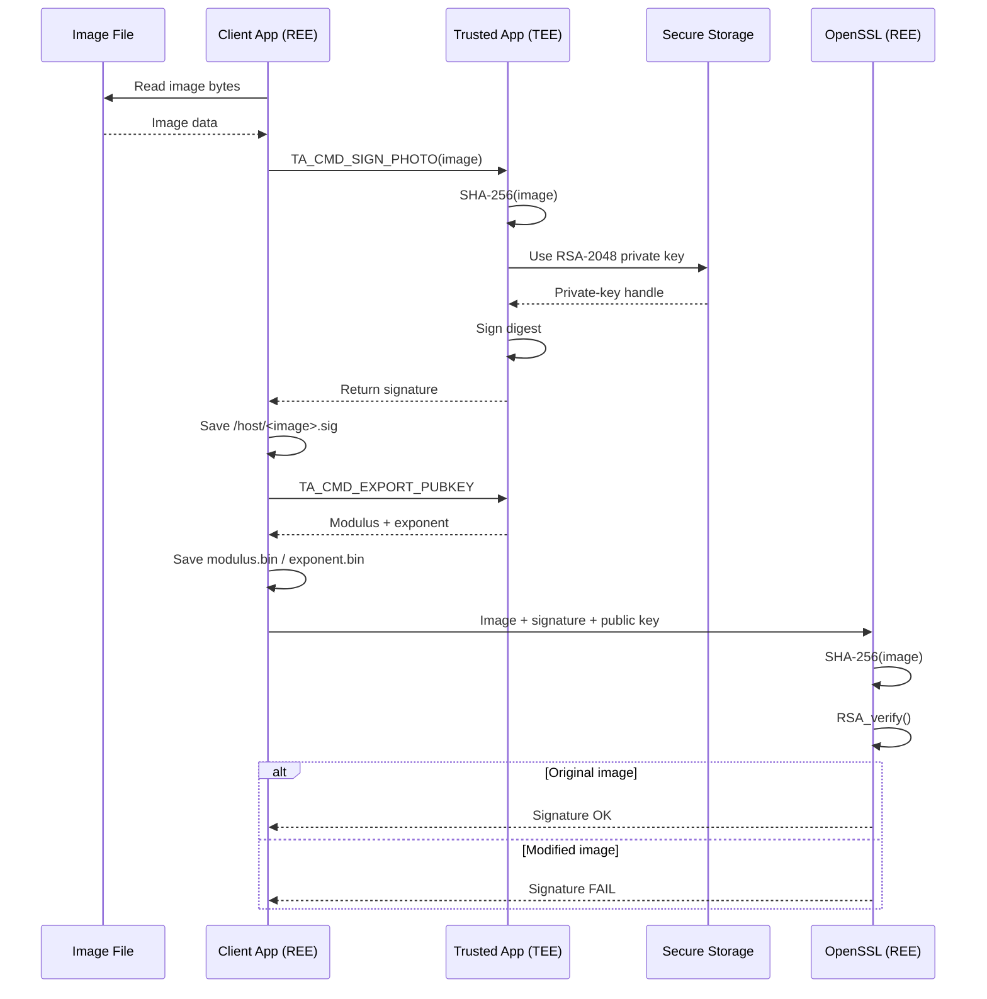

# OP-TEE Secure Image Signing System

A C-based image integrity verification project built with **OP-TEE**, using **SHA-256** and **RSA-2048 digital signatures** inside a Trusted Application (TA).

The system keeps private-key operations inside the TEE, returns only the generated signature to the Rich Execution Environment (REE), and verifies signed images with OpenSSL using exported public-key components.

## Key Features

- SHA-256 hashing inside an OP-TEE Trusted Application
- RSA-2048 signing with `RSASSA-PKCS1-v1_5-SHA256`
- RSA key generation and storage through OP-TEE Secure Storage
- Public-key export as RSA modulus and exponent
- Batch signing of files from an image directory
- Signature verification in the REE using OpenSSL
- Tampered-image test demonstrating signature verification failure after image modification

## System Architecture


## How It Works

### 1. Establish a session with the Trusted Application

The client application initializes an OP-TEE context and opens a session with the TA using the OP-TEE Client API.

### 2. Initialize the RSA key

When the TA is created, it attempts to open the RSA key object named `rsa_key` from Secure Storage.

If the key does not exist, the TA:

1. Allocates an RSA-2048 key-pair object.
2. Generates a new RSA key pair.
3. Stores the key object using OP-TEE Secure Storage.
4. Extracts the public modulus and exponent and stores them as `rsa_modulus` and `rsa_exponent` objects for later export.

The private key is not exported to the REE.

### 3. Sign an image inside the TEE

For each input image, the REE reads the file and sends its bytes to the TA using `TA_CMD_SIGN_PHOTO`.

Inside the TA:

```text
Image bytes
    ↓
SHA-256
    ↓
32-byte digest
    ↓
RSA-2048 private-key signing
RSASSA-PKCS1-v1_5-SHA256
    ↓
Digital signature
```

The signature is returned to the REE and saved as:

```text
/host/<image_filename>.sig
```

### 4. Export the public key

The REE invokes `TA_CMD_EXPORT_PUBKEY` to obtain the RSA public-key components stored by the TA.

They are written as:

```text
/host/modulus.bin
/host/exponent.bin
```

Only public-key components are exported. The RSA private key remains in the TEE.

### 5. Verify the signature in the REE

The verification code uses OpenSSL to:

1. Read the image.
2. Recompute its SHA-256 digest.
3. Load the `.sig` file.
4. Reconstruct the RSA public key from the modulus and exponent.
5. Call `RSA_verify()` with the SHA-256 digest, signature, and public key.

A valid original image produces a successful verification result. If the image content is modified while reusing the original signature, verification fails because the recomputed SHA-256 digest no longer matches the signed digest.

## Signing and Verification Sequence



## OP-TEE Commands

The client and TA communicate using the command IDs defined in `save_pic_ta.h`.

| Command | Purpose |
|---|---|
| `TA_SECURE_STORAGE_CMD_READ_RAW` | Read a raw object from Secure Storage |
| `TA_SECURE_STORAGE_CMD_WRITE_RAW` | Write a raw object to Secure Storage |
| `TA_SECURE_STORAGE_CMD_DELETE` | Delete an object from Secure Storage |
| `TA_CMD_HASH_PHOTO` | Compute SHA-256 inside the TA |
| `TA_CMD_SIGN_PHOTO` | Hash and sign image data inside the TA |
| `TA_CMD_EXPORT_PUBKEY` | Export RSA modulus and public exponent |

## Project Structure

```text
optee-secure-image-signing/
├── README.md
├── LICENSE
├── .gitignore
├── photo_samples/
└── save_pic/
    ├── Makefile
    ├── host/
    │   ├── main.c
    │   ├── verify_signature.c
    │   ├── verify_signature.h
    │   └── Makefile
    └── ta/
        ├── save_pic_ta.c
        ├── user_ta_header_defines.h
        ├── sub.mk
        ├── Makefile
        └── include/
            └── save_pic_ta.h
```

## Main Source Files

### `save_pic/host/main.c`

REE-side client application responsible for:

- initializing and closing the OP-TEE session
- scanning image files
- sending image data to the TA
- saving returned signatures
- requesting the public-key components
- starting verification tests

### `save_pic/ta/save_pic_ta.c`

Trusted Application responsible for:

- RSA-2048 key initialization
- Secure Storage operations
- SHA-256 hashing
- RSA digital signing
- public-key component export
- OP-TEE command dispatch

### `save_pic/host/verify_signature.c`

REE-side OpenSSL verification logic responsible for:

- recalculating SHA-256
- reconstructing an RSA public key from modulus and exponent
- calling `RSA_verify()`
- reporting successful or failed verification

## Demonstration Flow

The current demo flow uses images under:

```text
/usr/share/photo_samples
```

and writes generated artifacts under:

```text
/host
```

Typical outputs include:

```text
/host/<image>.sig
/host/modulus.bin
/host/exponent.bin
```

For the tampering test, a modified image is placed at:

```text
/usr/share/fake_photo/fake.jpg
```

and is verified using a signature originating from the unmodified image. Because the modified image produces a different SHA-256 digest, signature verification fails.

Example result:

```text
[✔] Signature OK: /usr/share/photo_samples/<original-image>
[✘] Signature FAIL: /usr/share/fake_photo/fake.jpg
```

## Security Boundary

The project separates responsibilities between the normal and secure worlds:

**REE / Normal World**

- file I/O
- directory scanning
- `.sig` output
- public-key handling
- OpenSSL verification

**TEE / Secure World**

- SHA-256 hashing for signing
- RSA-2048 private-key operations
- Secure Storage
- digital signature generation

The main security goal is to avoid exposing the RSA private key to the normal-world application while still allowing images to be signed and verified.

## Technologies

- C
- Linux / Buildroot
- OP-TEE Client API
- OP-TEE Internal Core API
- Trusted Applications
- Secure Storage
- SHA-256
- RSA-2048
- PKCS#1 v1.5 signature scheme
- OpenSSL

## Repository Notes

This repository contains the core source code used for the project demonstration. Build artifacts, generated signatures, and temporary files are excluded from version control.

## What This Project Demonstrates

This project demonstrates practical use of a Trusted Execution Environment rather than implementing RSA or SHA-256 algorithms from scratch. It focuses on:

- separating sensitive cryptographic operations from normal-world code
- invoking a Trusted Application from an REE client
- managing cryptographic key objects with OP-TEE Secure Storage
- using OP-TEE cryptographic APIs for hashing and signing
- integrating a TEE-generated signature with OpenSSL verification in Linux
- validating image integrity with a tampering test

