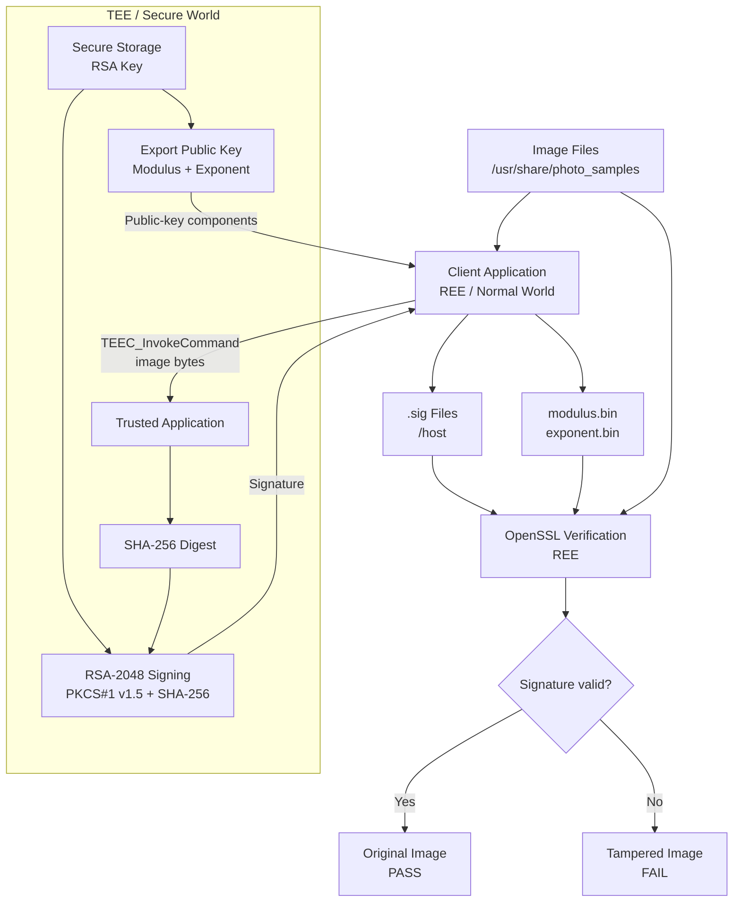
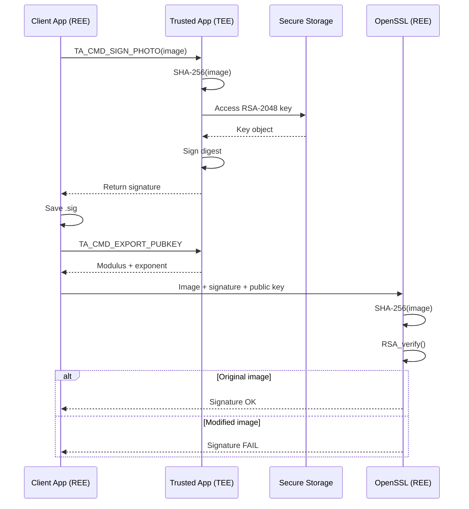
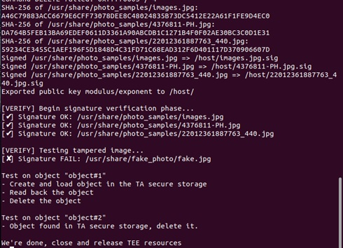

# OP-TEE Secure Image Signing System

A C-based image integrity verification project built with **OP-TEE**, **SHA-256**, **RSA-2048**, and **OpenSSL**.

The system keeps private-key operations inside the Trusted Execution Environment (TEE), returns only signatures to the Rich Execution Environment (REE), and verifies image integrity with exported public-key components.

## Highlights

- SHA-256 hashing inside an OP-TEE Trusted Application
- RSA-2048 digital signing with `RSASSA-PKCS1-v1_5-SHA256`
- RSA key management through OP-TEE Secure Storage
- Public-key export as RSA modulus and exponent
- Batch image signing from a directory
- Signature verification in the REE using OpenSSL
- Tampered-image test that demonstrates verification failure after image modification

## System Architecture



## How It Works

### 1. Open a session with the Trusted Application

The REE client initializes an OP-TEE context and opens a session with the TA using the OP-TEE Client API.

### 2. Initialize the RSA key

When the TA starts, it attempts to open the RSA key object named `rsa_key` from Secure Storage.

If the key does not exist, the TA:

1. Allocates an RSA-2048 key-pair object.
2. Generates a new RSA key pair.
3. Stores the key object using OP-TEE Secure Storage.
4. Extracts the public modulus and exponent for later export.

The private key is not exported to the REE.

### 3. Sign an image inside the TEE

For each image, the REE reads the file and sends its bytes to the TA with `TA_CMD_SIGN_PHOTO`.

```text
Image bytes
    ↓
SHA-256
    ↓
32-byte digest
    ↓
RSA-2048 private-key signing
RSASSA-PKCS1-v1_5-SHA256
    ↓
Digital signature
```

The signature is returned to the REE and saved as:

```text
/host/<image_filename>.sig
```

### 4. Export the public key

The REE invokes `TA_CMD_EXPORT_PUBKEY` and receives the RSA public-key components:

```text
/host/modulus.bin
/host/exponent.bin
```

Only public information is exported.

### 5. Verify the signature in the REE

The OpenSSL verification code:

1. Reads the image.
2. Recomputes its SHA-256 digest.
3. Loads the `.sig` file.
4. Reconstructs the RSA public key from the modulus and exponent.
5. Calls `RSA_verify()`.

If the image content is modified while reusing the original signature, verification fails because the recomputed digest no longer matches the signed digest.

## Signing and Verification Flow



## Project Structure

```text
optee-secure-image-signing/
├── README.md
├── LICENSE
├── .gitignore
├── photo_samples/
└── save_pic/
    ├── Makefile
    ├── host/
    │   ├── main.c
    │   ├── verify_signature.c
    │   ├── verify_signature.h
    │   └── Makefile
    └── ta/
        ├── save_pic_ta.c
        ├── user_ta_header_defines.h
        ├── sub.mk
        ├── Makefile
        └── include/
            └── save_pic_ta.h
```

## Main Components

### REE Client — `save_pic/host/main.c`

Responsible for:

- opening and closing the OP-TEE session
- scanning input images
- sending image data to the TA
- saving returned signatures
- requesting public-key components
- launching verification tests

### Trusted Application — `save_pic/ta/save_pic_ta.c`

Responsible for:

- RSA-2048 key initialization
- Secure Storage operations
- SHA-256 hashing
- RSA digital signing
- public-key export
- OP-TEE command dispatch

### Verification — `save_pic/host/verify_signature.c`

Responsible for:

- recalculating SHA-256
- rebuilding the RSA public key from modulus and exponent
- calling `RSA_verify()`
- reporting verification success or failure

## Demo Behavior

Input images are read from:

```text
/usr/share/photo_samples
```

Generated files are written under:

```text
/host
```

Typical outputs:

```text
/host/<image>.sig
/host/modulus.bin
/host/exponent.bin
```

A modified test image is placed under:

```text
/usr/share/fake_photo/fake.jpg
```

Using the original signature with the modified image causes verification to fail.

Example:

```text
[✔] Signature OK: /usr/share/photo_samples/<original-image>
[✘] Signature FAIL: /usr/share/fake_photo/fake.jpg
```

## Demo Result

The following run shows successful verification for the original images and verification failure for the tampered image.



## Security Boundary

**REE / Normal World**
- file I/O and directory scanning
- signature-file output
- public-key handling
- OpenSSL verification

**TEE / Secure World**
- SHA-256 hashing for signing
- RSA-2048 private-key operations
- Secure Storage
- digital signature generation

The key design goal is to keep private-key operations inside the secure world while allowing normal-world software to verify signed images.

## Technologies

- C
- Linux / Buildroot
- OP-TEE Client API
- OP-TEE Internal Core API
- Trusted Applications
- Secure Storage
- SHA-256
- RSA-2048
- PKCS#1 v1.5 signature scheme
- OpenSSL

## What This Project Demonstrates

This project focuses on applying OP-TEE and cryptographic APIs in a working image-signing pipeline rather than implementing RSA or SHA-256 from scratch.

It demonstrates:

- separation between REE and TEE responsibilities
- invocation of a Trusted Application from a normal-world client
- key-object management with OP-TEE Secure Storage
- cryptographic hashing and signing inside the TEE
- OpenSSL-based verification in Linux
- tampered-image detection through signature verification
